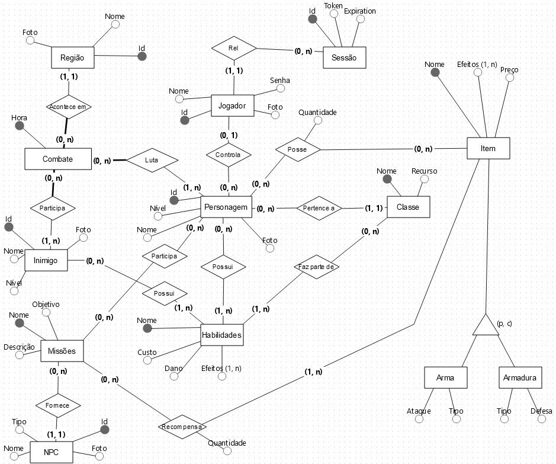
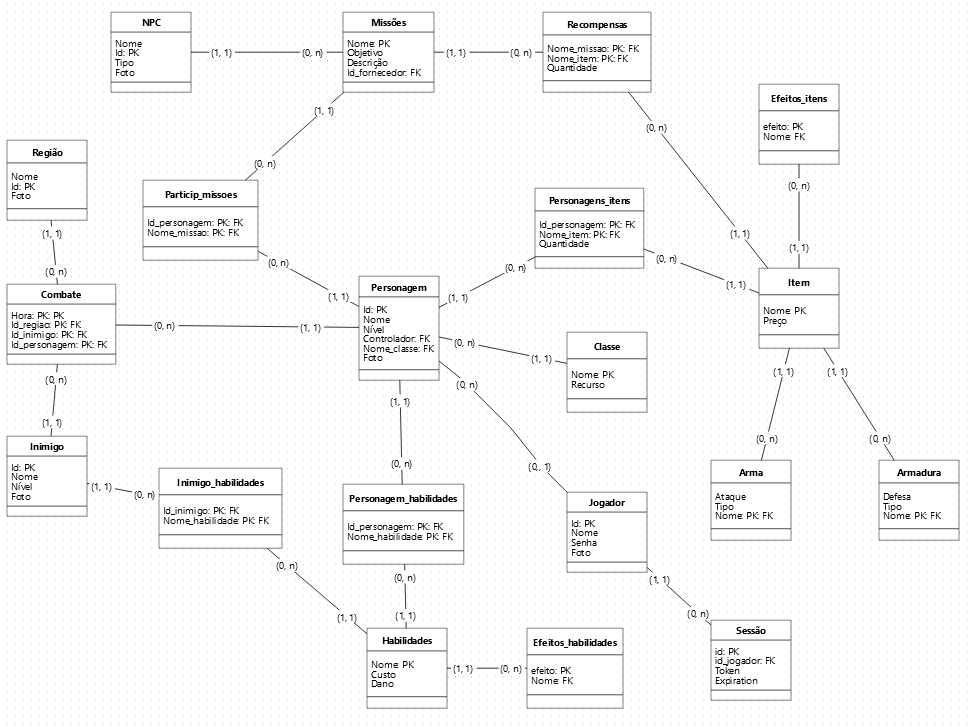

---

# Trabalho de Banco de Dados - Sistema de Gerenciamento de RPG

📝 **Descrição**
Este projeto implementa um sistema de gerenciamento de RPG com diversas entidades e funcionalidades que permitem a criação e o controle de personagens, missões, itens, e combates, além de possibilitar a gestão de jogadores e suas sessões de login. O objetivo é criar um banco de dados robusto e funcional que suporte todas as operações necessárias para o jogo.

---

🚀 **Funcionalidades**
- **Gerenciamento de Personagens:** Criação, leitura, atualização e exclusão de personagens, incluindo suas habilidades e itens.
- **Gerenciamento de Missões:** Controle de missões com definição de objetivos, recompensas, e a participação de personagens.
- **Sistema de Combate:** Registro de combates entre personagens e inimigos em diferentes regiões.
- **Gerenciamento de Sessões:** Controle de login dos jogadores com armazenamento seguro de senhas e geração de tokens de sessão.
- **Consultas Relacionais:** Realização de consultas complexas envolvendo múltiplas tabelas.
- **Camada de Persistência:** Implementação de uma camada de persistência que conecta a interface gráfica do jogo ao banco de dados.

---

💻 **Modelo de Entidade Relacionamento**
- O modelo de entidade relacionamento foi desenvolvido utilizando [nome da ferramenta de modelagem].
- Inclui as entidades: `Personagem`, `Classe`, `Habilidades`, `Inimigo`, `Regiao`, `Combate`, `Item`, `NPC`, `Missoes`, `Recompensa`, e `Jogador`.
- As entidades estão devidamente normalizadas para garantir a integridade dos dados e a eficiência nas operações.
  

---

💾 **Modelo Relacional**
- O modelo relacional foi gerado a partir do MER, mapeando cada entidade para uma tabela no banco de dados.
- As relações entre as tabelas foram definidas com chaves primárias e estrangeiras, assegurando a consistência referencial.


---

🧠 **Consultas em Álgebra Relacional**
- O projeto inclui cinco consultas em álgebra relacional, cada uma envolvendo pelo menos três tabelas, demonstrando a complexidade e a robustez das interações entre os dados.

```
#pega o nome, a classe e as habilidades de um personagem
(usa as tabelas personagem, classe, personagem_habilidades e habilidades)

SELECT p.Nome AS Personagem, c.Nome AS Classe, h.Nome AS Habilidade
FROM Personagem p
JOIN Classe c ON p.Nome_classe = c.Nome
JOIN Personagem_habilidades ph ON p.id = ph.id_personagem
JOIN Habilidades h ON ph.Nome_habilidade = h.Nome;

==============================================================================

#lista os combates com a hora, regiao, nome dos inimigos e nome dos jogdores
(usa as tabelas combate, inimigo, personagem e região)

SELECT c.Hora, i.Nome AS Inimigo, p.Nome AS Personagem, r.Nome AS Regiao
FROM Combate c
JOIN Inimigo i ON c.id_inimigo = i.id
JOIN Personagem p ON c.id_personagem = p.id
JOIN Regiao r ON c.id_regiao = r.id;

==============================================================================

#lista as missões, com seus ojetivos e items de recompensa
(usa as tabelas missões, recompensa e item)

SELECT m.Nome AS Missao, m.Objetivo, i.Nome AS Item, r.Quantidade
FROM Missoes m
JOIN Recompensa r ON m.Nome = r.Nome_missao
JOIN Item i ON r.Nome_item = i.Nome;

==============================================================================

#lista os personagens com seu inventario e quantidade de items
(usa as tabelas personagem, personagens_itens e Item)

SELECT p.Nome AS Personagem, i.Nome AS Item, pi.Quantidade
FROM Personagem p
JOIN Personagens_itens pi ON p.id = pi.id_personagem
JOIN Item i ON pi.Nome_item = i.Nome;

==============================================================================

#lista as missões, os npcs que fornecem a missão e os personagens que atualmente participam da missão
(Usa a tabela missão, npc, participa_missões e personagem)

SELECT m.Nome AS Missao, npc.Nome AS NPC, p.Nome AS Personagem
FROM Missoes m
JOIN NPC npc ON m.id_fornecedor = npc.id
JOIN Participa_missoes pm ON m.Nome = pm.Nome_missao
JOIN Personagem p ON pm.id_personagem = p.id;
```
---

📝 **Avaliação das Formas Normais**
- Cinco tabelas foram analisadas e normalizadas até a terceira forma normal, assegurando a eliminação de redundâncias e a minimização de anomalias de inserção, atualização, e exclusão.

---

📜 **Script SQL**
- O script SQL utilizado para gerar o banco de dados está disponível no repositório do projeto no GitHub.
- Inclui a criação de todas as tabelas, índices, e a inserção de registros iniciais para teste.

---

📂 **Camada de Persistência**
- O projeto conta com uma camada de persistência que permite a interação entre a interface gráfica do jogo e o banco de dados.
- A arquitetura e o código fonte estão disponíveis no repositório do GitHub, junto com um diagrama que detalha essa camada.

---

🖥️ **Programa CRUD**
- Foi desenvolvido um programa com operações de CRUD (Create, Read, Update, Delete) para um conjunto de pelo menos três tabelas relacionadas.
- O código fonte do programa está disponível no repositório do GitHub.

---

👁️ **View e Procedure**
- O banco de dados implementa uma `View` para simplificar consultas complexas.
- Uma `Procedure` foi criada com comandos condicionais para automatizar operações frequentes no banco de dados.

---

📦 **Inserção de Dados Binários**
- O projeto inclui a funcionalidade de inserir dados binários, como fotos ou documentos, diretamente no banco de dados.

---

📖 **Como Executar**
Para executar o projeto, siga as etapas abaixo:

1. Clone o repositório do projeto:
   ```bash
   git clone [(https://github.com/edufrma/trabalho-banco-dados/]
   ```

2. Execute o script SQL para criar o banco de dados:
   ```bash
   colocar aqui
   ```

3. Compile e execute o programa:
   ```bash
    npm run dev
  ```

4. Acesse o programa e explore as funcionalidades de gerenciamento de RPG!

---
